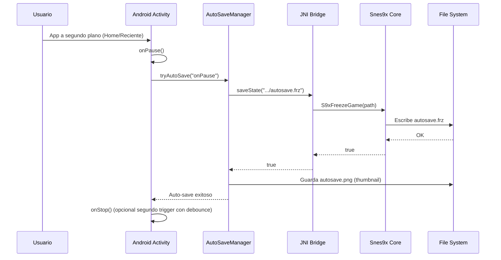

# NandaSNES: UX/UI avanzada + Save System (Android-first)

## 1) Overlay táctil SNES + hápticos

### Opción A: Jetpack Compose (recomendada)
- Usar una capa `Box` transparente encima del `SurfaceView`/`TextureView` del core.
- Distribución:
  - Izquierda abajo: D-pad (`UP/DOWN/LEFT/RIGHT`)
  - Derecha abajo: `A/B/X/Y`
  - Centro abajo: `START/SELECT`
  - Arriba: `L/R`
- En cada botón capturar `ACTION_DOWN` y `ACTION_UP` con `OnTouchListener` para latencia mínima.
- Feedback háptico:
  - API >= 31: `VibratorManager.defaultVibrator`
  - API < 31: `Vibrator`
  - En `ACTION_DOWN`: `VibrationEffect.createPredefined(VibrationEffect.EFFECT_CLICK)`

### Opción B: ConstraintLayout clásico
- `FrameLayout` raíz:
  1. Vista emulador (`SurfaceView`)
  2. `ConstraintLayout` overlay con botones alpha ~0.6-0.8
- Cada botón ejecuta:
  - `ACTION_DOWN`: háptico + `nativeReportButton(code, true)`
  - `ACTION_UP/CANCEL`: `nativeReportButton(code, false)`

## 2) Flujo de Input Android -> JNI -> Snes9x

1. `OnTouchListener` detecta `ACTION_DOWN` o `ACTION_UP`.
2. Kotlin llama `NativeBridge.reportButton(buttonCode, pressed)`.
3. JNI resuelve `Java_com_nandanes_emu_NativeBridge_reportButton`.
4. C++ llama a `S9xReportButton(buttonCode, pressed)`.
5. Core Snes9x aplica estado al frame activo.

## 3) Save States (5 slots + thumbnail)

### API core
- Guardar: `S9xFreezeGame(path)`
- Cargar: `S9xUnfreezeGame(path)`

### Estructura de slots
- Manuales: `slot_1.frz` ... `slot_5.frz`
- Auto-save dedicado: `autosave.frz` (separado de los slots manuales)
- Thumbnail:
  - `slot_1.png` ... `slot_5.png`
  - `autosave.png`

### Captura thumbnail (propuesta)
- Después de `S9xFreezeGame` exitoso:
  - Obtener último frame renderizado (RGBA)
  - Escalar a miniatura (p.ej. 320x224 -> 160x112)
  - Guardar PNG junto al `.frz`

## 4) Persistencia de rutas segura

### Android (Scoped Storage friendly)
- Preferir almacenamiento interno app-private:
  - `context.filesDir/saves/*.frz`
  - `context.filesDir/thumbs/*.png`
- Ventajas:
  - Sin permisos extra de storage
  - Limpio y aislado por app

Si requieres export/import visible al usuario:
- Usar SAF (`ACTION_CREATE_DOCUMENT` / `ACTION_OPEN_DOCUMENT`)
- Mantener URI persistentes con `takePersistableUriPermission`

### Windows
- Ruta por usuario:
  - `%LOCALAPPDATA%/NandaSNES/saves/*.frz`
  - `%LOCALAPPDATA%/NandaSNES/thumbs/*.png`
- Crear carpetas al iniciar y validar escritura.

## 5) Auto-save robusto

### Triggers Android
- `onPause()`
- `onStop()`
- Batería crítica (ej. <= 8%) vía `BroadcastReceiver` o chequeo periódico.

### Política recomendada
- Debounce de auto-save (p.ej. no guardar más de 1 vez cada 2-3 segundos).
- Evitar guardado si no hay ROM cargada o core no inicializado.
- Escribir primero a temporal y luego rename atómico cuando sea posible.

## 6) Carga del último auto-save al reabrir ROM

1. Al abrir ROM, buscar `autosave.frz` asociado al mismo juego.
2. Si existe:
  - Mostrar diálogo "Continuar desde auto-save".
  - O cargar automáticamente según preferencia del usuario.
3. Si falla la carga: arrancar desde boot normal.

## 7) Diagrama de flujo (minimizar app -> auto-save)

## Referencia del repositorio
- GitHub: `https://github.com/Shoropio/NandaSNES`
